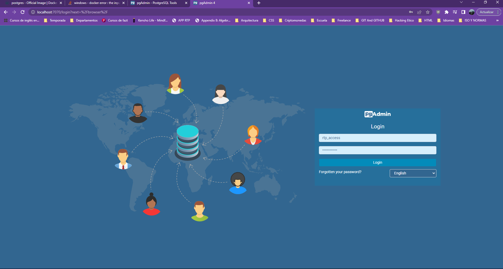
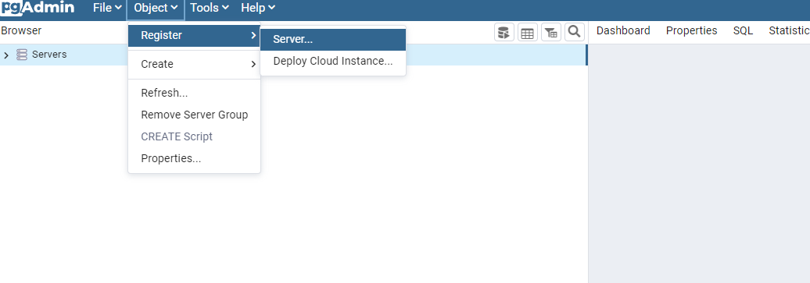
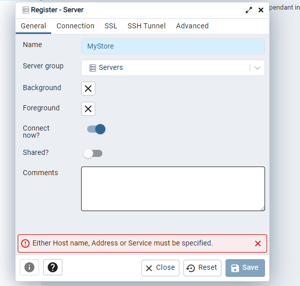
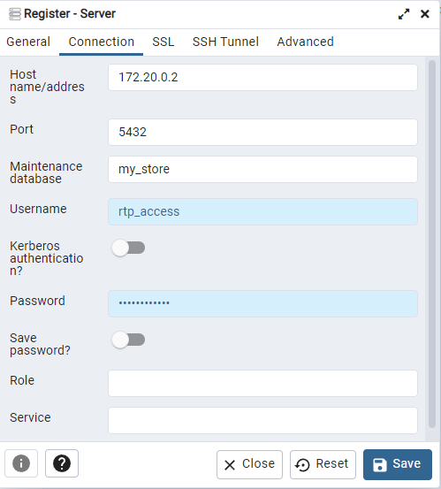

# Crear un proyecto completo con NodeJS
La idea de este repo es ser una guia de inicio para cualquier proyecto de NodeJS

Este proyecto utiliza los siguientes componentes

1. Node https://node-postgres.com/
2. ExpressJS http://expressjs.com/es/4x/api.html
3. Nodemon https://github.com/remy/nodemon
4. Dotenv https://github.com/motdotla/dotenv
5. Cors. https://github.com/expressjs/cors
6. Docker. https://hub.docker.com/
7. PG-Admin. https://www.pgadmin.org/

## Proceso para crear una Api server con Express
1. Crear carpeta del proyecto 
   1. En windows desde cmd:
    ~~~
        mkdir nameProyect
    ~~~
2. Desde dentro de la carpeta instalar las caracteristicas por defecto de NodeJs, ExpressJs, Cors y Dotenv
   ~~~
        npm init -y
        npm i express cors dotenv
   ~~~
3.  Crea la carpeta Config y dentro config.js
    ~~~
        require('dotenv').config();

        const config = {
            port: process.env.PORT || 3030
        }
        module.exports = {config};
    ~~~
4. Crea el archivo .env en la raíz
   ~~~
        PORT = 3030
    ~~~
5. Crear carpeta Models dentro crear archivo server.js y codificar los valores iniciales de nuestro server
    ~~~
        const express =  require("express");
        const { config } = require( '../config/config' );
        const cors = require("cors");
        class Server{
            constructor(){
                this.app = express();
                this.port = process.env.PORT;
                this.middlewares();
                this.routes();
            }
            routes=()=>{
                //rutas visibles para usuarios
                this.app.use( '/users', require('../routes/users.routes') );
            }
            middlewares=()=>{
                this.app.use(express.static("public"));
                this.app.use(express.json());
                this.app.use(cors());
            }
            listen=()=>{
                this.app.listen(this.port, ()=>{
                    console.log(`Listening on the port: ${this.port}`);
                })
            }
        }
        module.exports= Server;
    ~~~    
6. Crear apps.js en la raíz de tu proyecto y codifcar trayendo el server e iniciando el metodo listen.
    ~~~
        const Server = require('./models/server');
        const server = new Server();
        server.listen();
    ~~~
Aqui recomiendo probar lo desarrollado hasta este punto con nodemon.

## Agregar Postgres con Docker
1. Agregar docker-compose.yml a la raíz del repo. Crear un par de servicios, uno para PostgreSQL y otro para PG-Admin (ten particular cuidado con los espacios, de la forma en que los guardes deberas ingresar tus datos de acceso)
    ~~~
        version: '3.3'
        services:
            postgres:
                image: postgres:13
                environment:
                - POSTGRES_DB=my_store
                - POSTGRES_USER=rtp_access
                - POSTGRES_PASSWORD=rtp_password
                ports:
                - 5432:5432
                volumes:
                - /data/postgres_data:/var/lib/postgresql/data
            
            pgadmin:
                image: dpage/pgadmin4
                environment:
                - PGADMIN_DEFAULT_EMAIL=alexmorjim@hotmail.com
                - PGADMIN_DEFAULT_PASSWORD=rtp_password
                ports:
                - 7070:80
    ~~~
2. Crear la carpeta data en el root y dentro postgres_data para la persistencia de datos.
3. Agregar docker-compose.yml, node_modules y .env a .gitignore que debe añadirse en la raíz
   ~~~
        //directories
        node_modules/ 

        //DB    
        postgres_data

        //docker
        docker-compose.yml

        //dote
        .env
   ~~~
4. Levanta tu contenedor con 
    ~~~
        docker-compose up -d 
    ~~~
    Acá puedes elegir levantar por seaparado cada servicio dentro de docker o todo junto
    ~~~
        1. docker-compose up -d postgres
        2. docker-compose up -d pgadmin
    ~~~
5. Configura pgAdmin
    1. accede con los datos que definiste
        
    2. abre el cuadro para registrar un nuevo server
        
    3. nombrar un nuevo server
        
    4. Para obtener la ip deberas correr
        ~~~
            docker ps 
            docker inspect "hash_ID"
        ~~~
    5. Registra  el nuevo server.
         
## Crea un pool de conexiones
1. Instala pg-admin
    ~~~
        npm install pg
    ~~~
2. Crea las variables de entorno restantes
    ~~~
        require('dotenv').config();

        const config = {
            env: process.env.NODE_ENV || 'dev',
            port: process.env.PORT || 3030,
            dbUser: process.env.DB_USER,
            dbPassword: process.env.DB_PASSWORD,
            dbHost: process.env.DB_HOST,
            dbName: process.env.DB_NAME,
            dbPort: process.env.DB_PORT
        }
        module.exports = {config};
    ~~~
3. Crea la carpeta libs y agregar nuestra pool de conexiones postgres.pool.js
    ~~~
        const { Pool } = require('pg')
        const { config } = require( '../config/config' );

        const USER = encodeURIComponent( config.dbUser );
        const PASSWORD = encodeURIComponent( config.dbPassword );
        const URL = `postgres://${USER}:${PASSWORD}@${config.dbHost}:${config.dbPort}/${config.dbName}`;

        const pool = new Pool({ connectionString:URL});
        module.exports = pool;
    ~~~
4. Crea la carpeta services y agrega el servicio user.service.js. Dentro establece los servicios que usarás
  ~~~
    const pool = require("../libs/postgres.pool");

    class UserService{
        constructor(){
            this.userTable = "worker"; 
            this.pool = pool;
            this.pool.on("error", (err)=>{
                console.log( err );
            })
        }
        createTable= async()=>{
            const sql = `CREATE TABLE ${this.userTable}( 
                                                id serial PRIMARY KEY, 
                                                name VARCHAR (40) NOT NULL,
                                                last_name VARCHAR (40) NOT NULL,
                                                credential INT NOT NULL,
                                                phone_number VARCHAR (20), 
                                                active boolean DEFAULT true
                                            );`;
            const response = await this.pool.query( sql );
            return {command:response.command, rows:response.rows};
        }
        createUser = async( name, lastName, credential, phoneNumber)=>{
            const sql = `INSERT INTO ${this.userTable} VALUES(0,'${name}', '${lastName}', ${credential}, '${phoneNumber}')`;
            const response = await this.pool.query( sql );
            return {command:response.command, rows:response.rows};
        }

        deleteTable = async()=>{
            const sql = `TRUNCATE ${this.userTable}`;
            const response = await this.pool.query( sql );
            return {command:response.command, rows:response.rows};
        }
    }
    module.exports = UserService;
  ~~~
4. Crea la carpeta de routes y dentro users.routes.js
    ~~~
        const { Router } = require("express");  
        const router = Router();
        const UserService = require("../services/users.service");
        const user = new UserService();

        router.post( "/createUser", async(req, res, next)=>{
            try{
                const {name,lastname, credential, phoneNumber} = req.body;
                const table = await user.createUser(name,lastname, credential, phoneNumber);
                res.status(200).send(table);
            }catch(err){
                next(err);
            }
        } );

        router.get( "/createUserTable",  async(req, res, next)=>{
            try{
                const table = await user.createTable();
                res.status(200).send(table);
            }catch(err){
                next(err);
            }
        } );
        router.get( "/deleteUserTable",  async(req, res, next)=>{
            try{
                const table = await user.deleteTable();
                res.status(200).send(table);
            }catch(err){
                next(err);
            }
        } )
        module.exports= router

    ~~~

## Apendice
### Comandos docker  
   1. Levantar server 
      ~~~
       docker-compose up -d 
      ~~~
   2. Bajar server
      ~~~
         docker-compose down
      ~~~
   3. Listar servicios
      ~~~
         docker-compose ps
      ~~~
   4. Ingresar al Server
      ~~~
         winpty docker-compose exec postgres bash
      ~~~
   5. Listar tablas en nuestro server
      ~~~
         \d
      ~~~
   6. Listar servicios a detalle
      ~~~
         docker ps 
      ~~~
   7. Inspeccionar servicio
      ~~~
         docker inspect "hash_ID"
      ~~~